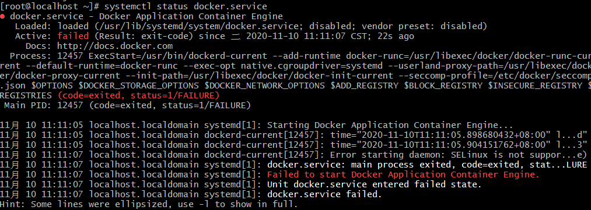
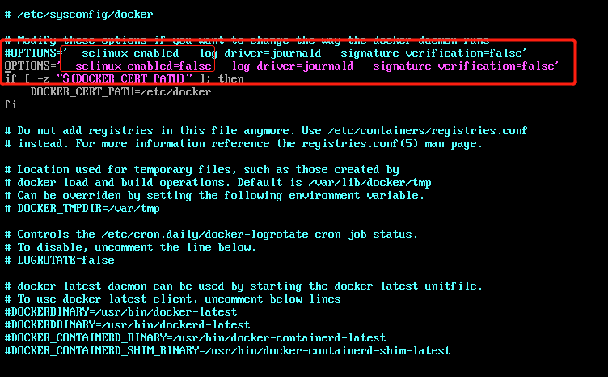

# Docker

用来记录学习过程中编写docker容器


# docker和docker-compose安装

[以下centos操作平台]

- docker安装

  ```
  $ yum -y install docker # 安装docker
  $ docker -v # 查看安装版本，测试是否正确安装
  $ systemctl start docker # 启动 Docker
  $ systemctl enable docker # 设置 Docker 系统重启自启动
  $ groupadd docker # 建立 docker 用户组
  $ usermod -aG docker $USER # 将当前用户加入 docker 组
  ```

- docker-compose安装

  ```
  # 访问 https://github.com/docker/compose/releases/ 获取最新安装版本
  
  $ curl -L https://github.com/docker/compose/releases/download/1.25.0/docker-compose-`uname -s`-`uname -m` -o /usr/local/bin/docker-compose # 下载安装docker-compose
  $ chmod +x /usr/local/bin/docker-compose # 赋予权限
  $ docker-compose -v # 查看安装版本，测试是否正确安装
  ```

## 补充

docker正常安装启动出现如下错误：



解决方法为：

编辑 `/etc/sysconfig/docker` ， 更改 `--selinux-enabled` 为 `--selinux-enabled=false` ，如下图所示：



